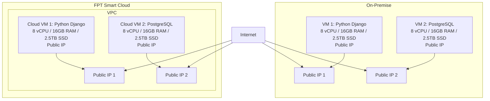

# Dự án chuyển đổi on-premise lên FPT Smart Cloud

## Yêu cầu:
Khách hàng cần di chuyển hệ thống hiện tại từ hạ tầng on-premise lên FPT Smart Cloud. Hệ thống bao gồm một website cá nhân sử dụng Python Django và một cơ sở dữ liệu PostgreSQL, được triển khai trên hai máy chủ trong cùng một VPC. Hệ thống cần có cấu hình VM tương ứng, bao gồm hai địa chỉ IP công cộng. Dung lượng dữ liệu hiện tại khoảng 5 TB và không yêu cầu backup dữ liệu, monitoring hoặc logging.

## Yêu cầu chi tiết từ khách hàng:
| Hạng mục                 | Thông tin yêu cầu                                                                   |
| ------------------------ | ----------------------------------------------------------------------------------- |
| **Hình thức triển khai** | Migration từ on‑premise lên FPT Smart Cloud                                         |
| **Thành phần hệ thống**  | Website (Python Django) + Database (PostgreSQL) trên 2 máy chủ trong cùng 1 VPC     |
| **Cấu hình VM yêu cầu**  | 16 vCPU, 32 GB RAM, 5 TB SSD                                                        |
| **Mạng và truy cập**     | Có 2 public IP                                                                      |
| **Dung lượng dữ liệu**   | Khoảng **5 TB** hiện tại                                                            |
| **Backup dữ liệu**       | **Không yêu cầu backup**                                                             |
| **Monitoring/Logging**   | **Không yêu cầu**                                                                   |

## Giải pháp đề xuất

## Phương án chuyển đổi

**Mô tả:**
| Bước                                 | Mô tả                                                                    |
| ------------------------------------ | ------------------------------------------------------------------------ |
| **1. Khảo sát & Phân tích hệ thống** | Đánh giá hệ thống hiện tại, tài nguyên VM, dữ liệu cần migrate           |
| **2. Chuẩn bị Hạ tầng Cloud**        | Tạo 2 VM trên FPT Cloud với cấu hình tương đương, thiết lập mạng        |
| **3. Di chuyển Dữ liệu & Ứng dụng**  | Chuyển dữ liệu từ on-premise lên cloud, cài đặt ứng dụng Django và PostgreSQL |
| **4. Kiểm thử, Go-live**  | Kiểm tra toàn bộ hệ thống, chuyển DNS, đảm bảo hoạt động liên tục       |

## Danh sách sản phẩm sử dụng (BOM)

| Tên sản phẩm             | Mô tả                                                   | Số lượng | Đơn vị tính | Ghi chú                                            |
| ------------------------ | ------------------------------------------------------- | -------- | ----------- | -------------------------------------------------- |
| **vCPU**                 | Số nhân xử lý cho Cloud VM                              | 16       | vCPU        | Đáp ứng nhu cầu xử lý Python Django và PostgreSQL  |
| **RAM**                  | Bộ nhớ cho Cloud VM                                     | 32       | GB          | Đảm bảo hiệu năng xử lý web và truy vấn database   |
| **SSD**                  | Lưu trữ cục bộ cho Cloud VM                             | 5        | TB          | Lưu ứng dụng và PostgreSQL                          |
| **Public IP tĩnh**       | Địa chỉ IP để truy cập VM từ Internet                   | 2        | IP          | Gán trực tiếp cho từng VM để phục vụ Web và SSH    |

## Kế hoạch triển khai
| **STT** | **Tên Task**                     | **Mô tả**                                                                       | **PIC** | **Support** | **Duration (ngày)** | **Ghi chú**                           |
| ------- | -------------------------------- | ------------------------------------------------------------------------------- | ------- | ----------- | ------------------- | ------------------------------------- |
| 1       | Khảo sát hệ thống                | Thu thập thông tin về hệ thống hiện tại: cấu hình VM, dịch vụ, dữ liệu, network | KH      | FCI         | 2                   | Khách hàng cung cấp chi tiết hạ tầng  |
| 2       | Chuẩn bị hạ tầng Cloud           | Tạo VM trên FPT Cloud, cấu hình mạng VPC, gán public IP                        | FCI     | KH          | 2                   | Cấu hình VM tương ứng                 |
| 3       | Di chuyển dữ liệu & ứng dụng     | Chuyển dữ liệu từ on-premise lên cloud, cài đặt ứng dụng Django và PostgreSQL  | FCI     | KH          | 3                   | Cần thời gian cho việc migrate dữ liệu |
| 4       | Kiểm thử, Go-live                | Kiểm tra toàn bộ hệ thống, chuyển DNS, đảm bảo hoạt động liên tục             | FCI     | KH          | 2                   | Đảm bảo tất cả hoạt động như mong đợi  |

## Tổng thời gian dự kiến
**9 ngày** (có thể giảm xuống ~7 ngày nếu thực hiện song song các bước 2 và 3).

### Ghi chú:
- Bước 1 và bước 2 có thể thực hiện song song với nhau để tiết kiệm thời gian.
- Bước 3 có thể bắt đầu ngay khi bước 2 hoàn thành và kết thúc, tùy thuộc vào tốc độ di chuyển dữ liệu.

## Bảng giá dự kiến
| Tên sản phẩm             | Mô tả                                                   | Số lượng | Đơn vị tính | Ghi chú                                            | Đơn giá (VND) | Thành tiền (VND) |
| ------------------------ | ------------------------------------------------------- | -------- | ----------- | -------------------------------------------------- | ------------- | ---------------- |
| **vCPU**                 | Số nhân xử lý cho Cloud VM                              | 16       | vCPU        | Đáp ứng nhu cầu xử lý Python Django và PostgreSQL  | 150.000       | 2.400.000        |
| **RAM**                  | Bộ nhớ cho Cloud VM                                     | 32       | GB          | Đảm bảo hiệu năng xử lý web và truy vấn database   | 130.000       | 4.160.000        |
| **SSD**                  | Lưu trữ cục bộ cho Cloud VM                             | 5        | TB          | Lưu ứng dụng và PostgreSQL                          | 3.000         | 15.000.000       |
| **Public IP tĩnh**       | Địa chỉ IP để truy cập VM từ Internet                   | 2        | IP          | Gán trực tiếp cho từng VM để phục vụ Web và SSH    | 15.000        | 30.000           |

## Tổng chi phí dự kiến / tháng (chưa gồm VAT):
**21.590.000 VND** 

### Lưu ý:
- Đơn giá ở đây là giá giả định, có thể thay đổi tùy theo chương trình khuyến mãi hoặc cam kết sử dụng.
- Tổng chi phí này chưa bao gồm chi phí cho các dịch vụ khác như backup, monitoring, logging vì khách hàng không yêu cầu sử dụng.