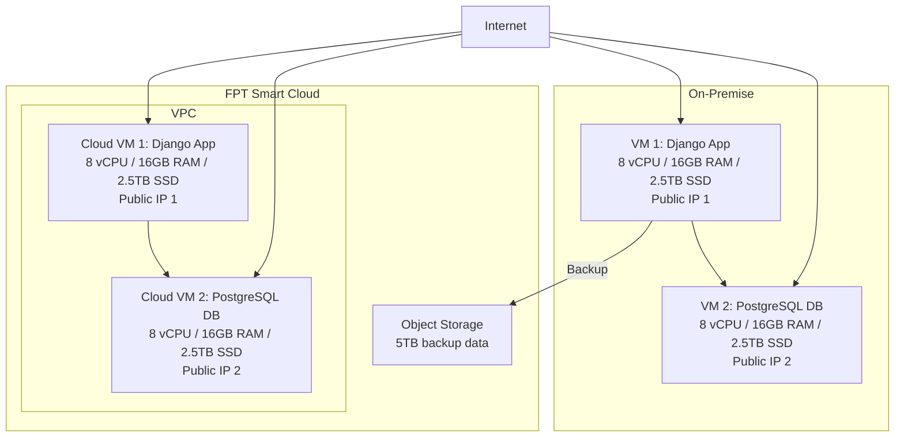

# Dự án di chuyển hệ thống lên FPT Smart Cloud

## Yêu cầu
Khách hàng cần di chuyển hệ thống hiện tại từ hạ tầng on‑premise lên FPT Smart Cloud. Hệ thống bao gồm một website cá nhân chạy Python Django và một cơ sở dữ liệu PostgreSQL, hiện đang chạy trên 2 máy chủ trong cùng một VPC. Việc chuyển đổi cần đảm bảo duy trì cấu hình tương đương, có 2 IP công cộng, đồng thời không yêu cầu các dịch vụ firewall, monitoring và logging.

### Yêu cầu chi tiết từ khách hàng:
| Hạng mục                 | Thông tin yêu cầu                                                                   |
| ------------------------ | ----------------------------------------------------------------------------------- |
| **Hình thức triển khai** | Migration từ on‑premise lên FPT Smart Cloud                                         |
| **Thành phần hệ thống**  | Website (Python Django) + Database (PostgreSQL) trên 2 máy chủ                     |
| **Cấu hình VM yêu cầu**  | 16 vCPU, 32 GB RAM, 5 TB SSD                                                        |
| **Mạng và truy cập**     | Có 2 public IP; không yêu cầu firewall                                              |
| **Backup dữ liệu**       | **Không đề cập, xác nhận thêm nếu cần**                                             |
| **Monitoring/Logging**   | **Không yêu cầu**                                                                   |
| **Dung lượng dữ liệu**   | Khoảng **5 TB** hiện tại (dùng để ước tính dung lượng backup hoặc lưu trữ dự phòng) |

## Giải pháp đề xuất

```mermaid
flowchart TB
    subgraph s1["On-Premise"]
        OPVM1["VM 1: Django App<br>8 vCPU / 16GB RAM / 2.5TB SSD<br>Public IP 1"]
        OPVM2["VM 2: PostgreSQL DB<br>8 vCPU / 16GB RAM / 2.5TB SSD<br>Public IP 2"]
    end
    subgraph VPC["VPC"]
        CloudVM1["Cloud VM 1: Django App<br>8 vCPU / 16GB RAM / 2.5TB SSD<br>Public IP 1"]
        CloudVM2["Cloud VM 2: PostgreSQL DB<br>8 vCPU / 16GB RAM / 2.5TB SSD<br>Public IP 2"]
    end
    subgraph subGraph2["FPT Smart Cloud"]
        VPC
        Storage["Object Storage<br>5TB backup data"]
    end
        OPVM1 --> OPVM2
        CloudVM1 --> CloudVM2
        OPVM1 -- Backup --> Storage
        InternetNode["Internet"] --> OPVM1 & CloudVM1
        InternetNode --> OPVM2 & CloudVM2
```

## Phương án chuyển đổi

```mermaid
flowchart LR
A[📌 1. Khảo sát &<br>Phân tích hệ thống]
B[🛠️ 2. Chuẩn bị<br>Hạ tầng Cloud]
C[☁️ 3. Di chuyển<br>Dữ liệu & Ứng dụng]
D[🚀 4. Kiểm thử,<br>Go-live & Giám sát]

A --> B --> C --> D

%% Styling
classDef phase fill:#e3f2fd,stroke:#2196f3,color:#0d47a1,font-weight:bold;
class A,B,C,D phase;
```
    
**Mô tả:**
| Bước                                 | Mô tả                                                                    |
| ------------------------------------ | ------------------------------------------------------------------------ |
| **1. Khảo sát & Phân tích hệ thống** | Đánh giá hệ thống hiện tại, tài nguyên VM, dữ liệu cần migrate           |
| **2. Chuẩn bị Hạ tầng Cloud**        | Tạo VM trên FPT Cloud với cấu hình tương đương, thiết lập mạng          |
| **3. Di chuyển Dữ liệu & Ứng dụng**  | Backup + chuyển dữ liệu (SCP/Object Storage), cài app, khôi phục DB      |
| **4. Kiểm thử, Go-live**  | Kiểm tra toàn hệ thống, chuyển DNS, thiết lập backup định kỳ            |
    

## Kế hoạch triển khai
| **STT** | **Tên Task**                     | **Mô tả**                                                                       | **PIC** | **Support** | **Duration (ngày)** | **Ghi chú**                           |
| ------- | -------------------------------- | ------------------------------------------------------------------------------- | ------- | ----------- | ------------------- | ------------------------------------- |
| 1       | Khảo sát hệ thống                | Đánh giá hệ thống hiện tại: cấu hình VM, dịch vụ, dữ liệu, network            | KH      | FCI         | 2                   | Khách hàng cung cấp chi tiết hạ tầng  |
| 2       | Chuẩn bị hạ tầng Cloud           | Tạo VM trên FPT Cloud với cấu hình tương đương, thiết lập mạng              | FCI     | KH          | 2                   | Thực hiện song song với bước 3       |
| 3       | Di chuyển Dữ liệu & Ứng dụng     | Backup + chuyển dữ liệu (SCP/Object Storage), cài ứng dụng, khôi phục DB      | FCI     | KH          | 3                   | Có thể thực hiện song song với bước 2 |
| 4       | Kiểm thử, Go-live                 | Kiểm tra toàn hệ thống, chuyển DNS, thiết lập backup định kỳ                 | FCI     | KH          | 2                   |                                      |

## Tổng thời gian dự kiến
**Tổng thời gian**: 7 ngày (có thể giảm xuống 5 ngày nếu thực hiện đồng thời bước 2 và bước 3).

## Bảng giá dự kiến
| Tên sản phẩm             | Mô tả                                                   | Số lượng | Đơn vị tính | Ghi chú                                            | Đơn giá (VND) | Thành tiền (VND) |
| ------------------------ | ------------------------------------------------------- | -------- | ----------- | -------------------------------------------------- | ------------- | ---------------- |
| **vCPU**                 | Số nhân xử lý cho Cloud VM                              | 16       | vCPU        | Đáp ứng nhu cầu xử lý Django và PostgreSQL         | 150.000       | 2.400.000        |
| **RAM**                  | Bộ nhớ cho Cloud VM                                     | 32       | GB          | Đảm bảo hiệu năng xử lý web và truy vấn database   | 130.000       | 4.160.000        |
| **SSD**                  | Lưu trữ cục bộ cho Cloud VM                             | 5        | TB          | Lưu ứng dụng, hệ điều hành, PostgreSQL             | 3.000.000     | 15.000.000       |
| **Public IP tĩnh**       | Địa chỉ IP để truy cập VM từ Internet                   | 2        | IP          | Gán trực tiếp cho VM                                 | 15.000        | 30.000           |
| **Object Storage**       | Lưu trữ dữ liệu backup dung lượng 5TB                   | 5        | TB          | Lưu dữ liệu lịch sử, backup định kỳ ngoài VM       | 2.500.000     | 12.500.000       |

### Tổng chi phí dự kiến / tháng (chưa gồm VAT):
**34.080.000 VND**

_Lưu ý:_
- Đơn giá ở đây là giá giả định, có thể thay đổi tùy theo chương trình khuyến mãi hoặc cam kết sử dụng.
- Một số dịch vụ như monitoring/logging có gói miễn phí, nhưng nên tư vấn khách hàng nâng cấp khi hệ thống mở rộng.