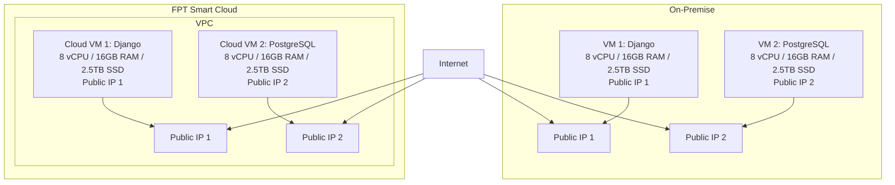

# Dự án chuyển đổi on-premise lên FPT Smart Cloud

## Yêu cầu
Khách hàng cần di chuyển hệ thống hiện tại từ hạ tầng on‑premise lên FPT Smart Cloud. Hệ thống bao gồm một website cá nhân sử dụng Python Django và một cơ sở dữ liệu PostgreSQL, được lưu trữ trên hai máy chủ trong cùng một VPC. Việc chuyển đổi cần đảm bảo duy trì cấu hình tương đương, có hai IP công cộng và không yêu cầu firewall, monitoring hay logging.

### Yêu cầu chi tiết từ khách hàng
| Hạng mục                 | Thông tin yêu cầu                                                                   |
| ------------------------ | ----------------------------------------------------------------------------------- |
| **Hình thức triển khai** | Migration từ on‑premise lên FPT Smart Cloud                                         |
| **Thành phần hệ thống**  | Website cá nhân (Python Django) + Database (PostgreSQL) trên 2 máy chủ             |
| **Cấu hình VM yêu cầu**  | 16 vCPU, 32 GB RAM, 5TB SSD                                                          |
| **Mạng và truy cập**     | Có 2 public IP; không yêu cầu firewall                                               |
| **Backup dữ liệu**       | **Không có yêu cầu backup**                                                          |
| **Monitoring/Logging**   | **Không yêu cầu**                                                                   |
| **Dung lượng dữ liệu**   | Khoảng **5 TB** hiện tại                                                            |

## Giải pháp đề xuất

## Phương án chuyển đổi

**Mô tả:**
| Bước                                 | Mô tả                                                                    |
| ------------------------------------ | ------------------------------------------------------------------------ |
| **1. Khảo sát & Phân tích hệ thống** | Đánh giá hệ thống hiện tại, tài nguyên VM, dữ liệu cần migrate           |
| **2. Chuẩn bị Hạ tầng Cloud**        | Tạo VM trên FPT Cloud với cấu hình tương đương, thiết lập mạng          |
| **3. Di chuyển Dữ liệu & Ứng dụng**  | Chuyển dữ liệu (SCP/Object Storage), cài đặt ứng dụng                   |
| **4. Kiểm thử, Go-live**  | Kiểm tra toàn hệ thống, chuyển DNS                                      |

## Danh sách sản phẩm sử dụng (BOM)

| Tên sản phẩm             | Mô tả                                                   | Số lượng | Đơn vị tính | Ghi chú                                            |
| ------------------------ | ------------------------------------------------------- | -------- | ----------- | -------------------------------------------------- |
| **vCPU**                 | Số nhân xử lý cho Cloud VM                              | 16       | vCPU        | Đáp ứng nhu cầu xử lý Django và PostgreSQL       |
| **RAM**                  | Bộ nhớ cho Cloud VM                                     | 32       | GB          | Đảm bảo hiệu suất xử lý web và truy vấn database   |
| **SSD**                  | Lưu trữ cục bộ cho Cloud VM                             | 5000     | GB          | Lưu ứng dụng, hệ điều hành, PostgreSQL             |
| **Public IP tĩnh**       | Địa chỉ IP để truy cập VM từ Internet                   | 2        | IP          | Gán trực tiếp cho VM, phục vụ Web & SSH            |

## Kế hoạch triển khai
| **STT** | **Tên Task**                     | **Mô tả**                                                                       | **PIC** | **Support** | **Duration (ngày)** | **Ghi chú**                           |
| ------- | -------------------------------- | ------------------------------------------------------------------------------- | ------- | ----------- | ------------------- | ------------------------------------- |
| 1       | Khảo sát hệ thống                | Thu thập thông tin về hệ thống hiện tại: cấu hình VM, dịch vụ, dữ liệu, network | KH      | FCI         | 2                   | Khách hàng cung cấp chi tiết hệ thống  |
| 2       | Đánh giá khả năng triển khai     | Phân tích yêu cầu, lên sizing cho cloud VM và storage phù hợp                   | FCI     | KH          | 1                   | Xác định cấu hình tương ứng           |
| 3       | Chuẩn bị hạ tầng Cloud           | Tạo VM, cấu hình mạng VPC, public IP                                           | FCI     | KH          | 2                   |                                         |
| 4       | Di chuyển dữ liệu ứng dụng       | Chuyển dữ liệu (SCP/Object Storage), cài đặt ứng dụng                         | FCI     | KH          | 3                   | Có thể thực hiện song song với bước 3 |
| 5       | Kiểm thử và Go-live             | Kiểm tra toàn hệ thống, chuyển DNS                                            | FCI     | KH          | 2                   |                                         |

### Tổng thời gian dự kiến
**Tổng thời gian:** 10 ngày (có thể giảm xuống ~8 ngày nếu thực hiện song song bước 3 và 4).

## Bảng giá dự kiến
| Tên sản phẩm             | Mô tả                                                   | Số lượng | Đơn vị tính | Ghi chú                                            | Đơn giá (VND) | Thành tiền (VND) |
| ------------------------ | ------------------------------------------------------- | -------- | ----------- | -------------------------------------------------- | ------------- | ---------------- |
| **vCPU**                 | Số nhân xử lý cho Cloud VM                              | 16       | vCPU        | Đáp ứng nhu cầu xử lý Django và PostgreSQL       | 150.000       | 2.400.000        |
| **RAM**                  | Bộ nhớ cho Cloud VM                                     | 32       | GB          | Đảm bảo hiệu suất xử lý web và truy vấn database   | 130.000       | 4.160.000        |
| **SSD**                  | Lưu trữ cục bộ cho Cloud VM                             | 5000     | GB          | Lưu ứng dụng, hệ điều hành, PostgreSQL             | 3.000         | 15.000.000       |
| **Public IP tĩnh**       | Địa chỉ IP để truy cập VM từ Internet                   | 2        | IP          | Gán trực tiếp cho VM, phục vụ Web & SSH            | 15.000        | 30.000           |

## Tổng chi phí dự kiến / tháng (chưa gồm VAT):
**21.590.000 VND**

_Lưu ý:_
- Đơn giá ở đây là giá giả định, có thể thay đổi tùy theo chương trình khuyến mãi hoặc cam kết sử dụng.
- Một số dịch vụ như monitoring/logging có gói miễn phí, nhưng nên tư vấn khách hàng nâng cấp khi hệ thống mở rộng.