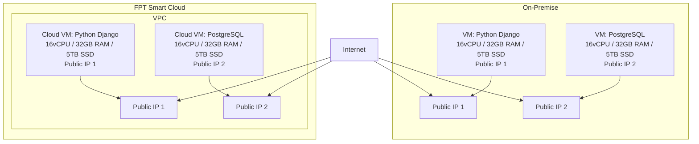

## Giải pháp đề xuất

## Phương án chuyển đổi

**Mô tả:**
| Bước                                 | Mô tả                                                                    |
| ------------------------------------ | ------------------------------------------------------------------------ |
| **1. Khảo sát & Phân tích hệ thống** | Đánh giá hệ thống hiện tại, tài nguyên VM, dữ liệu cần migrate           |
| **2. Chuẩn bị Hạ tầng Cloud**        | Tạo VM trên FPT Cloud với cấu hình tương đương, thiết lập mạng           |
| **3. Di chuyển Dữ liệu & Ứng dụng**  | Chuyển dữ liệu, cài đặt ứng dụng trên Cloud VM                            |
| **4. Kiểm thử, Go-live**             | Kiểm tra toàn bộ hệ thống hoạt động đúng, thực hiện chuyển DNS nếu cần      |

## Danh sách sản phẩm sử dụng (BOM)

| Tên sản phẩm             | Mô tả                                                   | Số lượng | Đơn vị tính | Ghi chú                                            |
| ------------------------ | ------------------------------------------------------- | -------- | ----------- | -------------------------------------------------- |
| **vCPU**                 | Số nhân xử lý cho Cloud VM                              | 32       | vCPU        | Đáp ứng nhu cầu xử lý cho Django và PostgreSQL     |
| **RAM**                  | Bộ nhớ cho Cloud VM                                     | 64       | GB          | Đảm bảo hiệu năng xử lý web và truy vấn database   |
| **SSD**                  | Lưu trữ cục bộ cho Cloud VM                             | 5        | TB          | Lưu ứng dụng, hệ điều hành, PostgreSQL             |
| **Public IP tĩnh**       | Địa chỉ IP để truy cập VM từ Internet                   | 2        | IP          | Gán cho từng VM, phục vụ cho Web & SSH             |