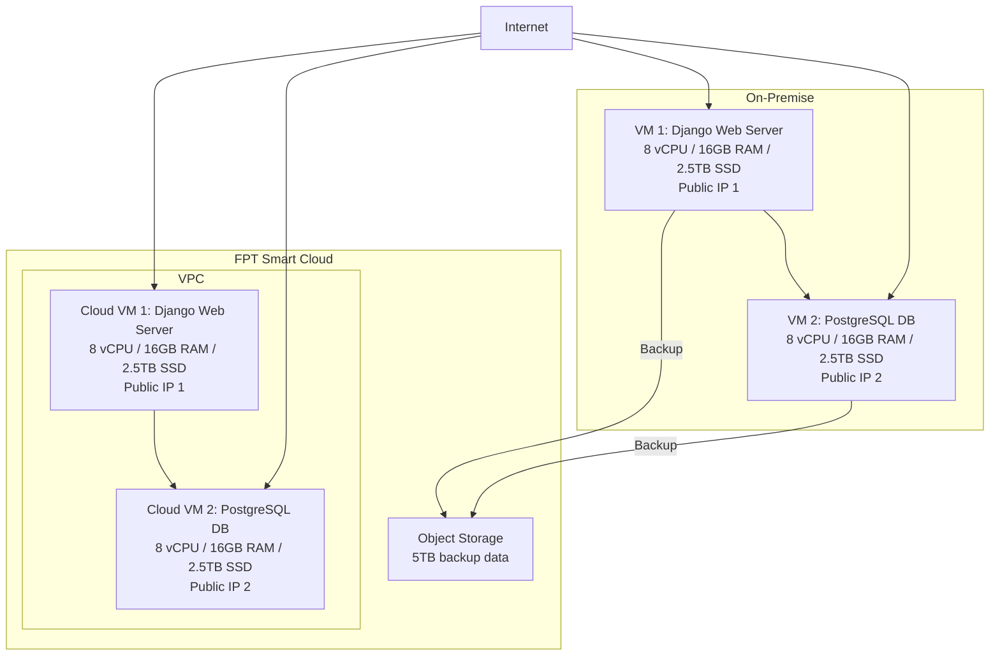
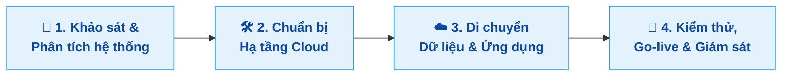

# Đề xuất Di chuyển Hệ thống Lên FPT Smart Cloud

## Yêu cầu
Khách hàng cần di chuyển hệ thống hiện tại từ hạ tầng on-premise lên FPT Smart Cloud. Hệ thống bao gồm một website cá nhân sử dụng Python Django và một cơ sở dữ liệu PostgreSQL, chạy trên 2 máy chủ trong cùng một VPC. Việc chuyển đổi cần đảm bảo duy trì cấu hình tương đương với 2 địa chỉ IP công cộng, không yêu cầu firewall, đồng thời đáp ứng yêu cầu backup dữ liệu. Monitoring và logging không nằm trong phạm vi yêu cầu lần này.

### Yêu cầu chi tiết từ khách hàng:
| Hạng mục                 | Thông tin yêu cầu                                                                   |
| ------------------------ | ----------------------------------------------------------------------------------- |
| **Hình thức triển khai** | Migration từ on-premise lên FPT Smart Cloud                                         |
| **Thành phần hệ thống**  | Website cá nhân (Python Django) + Database (PostgreSQL trên 2 máy chủ)            |
| **Cấu hình VM yêu cầu**  | 16 vCPU, 32 GB RAM, 5 TB SSD                                                        |
| **Mạng và truy cập**     | 2 public IP; sử dụng domain quangkhoi1228.com                                      |
| **Backup dữ liệu**       | **Có yêu cầu backup**                                                               |
| **Monitoring/Logging**   | **Không yêu cầu**                                                                   |
| **Dung lượng dữ liệu**   | Khoảng **5 TB** hiện tại                                                              |

## Giải pháp đề xuất

### Phương án chuyển đổi

**Mô tả:**
| Bước                                 | Mô tả                                                                     |
| ------------------------------------ | ------------------------------------------------------------------------- |
| **1. Khảo sát & Phân tích hệ thống** | Đánh giá hệ thống hiện tại, tài nguyên VM, dữ liệu cần migrate          |
| **2. Chuẩn bị Hạ tầng Cloud**        | Tạo VM trên FPT Cloud với cấu hình tương đương, thiết lập mạng          |
| **3. Di chuyển Dữ liệu & Ứng dụng**  | Backup và chuyển dữ liệu (SCP/Object Storage), cài đặt ứng dụng          |
| **4. Kiểm thử, Go-live**  | Kiểm tra toàn bộ hệ thống, chuyển DNS và thiết lập backup định kỳ      |

## Kế hoạch triển khai
| **STT** | **Tên Task**                     | **Mô tả**                                                                       | **PIC** | **Support** | **Duration (ngày)** | **Ghi chú**                           |
| ------- | -------------------------------- | ------------------------------------------------------------------------------- | ------- | ----------- | ------------------- | ------------------------------------- |
| 1       | Khảo sát hệ thống                | Thu thập thông tin về hệ thống hiện tại: cấu hình VM, dịch vụ, dữ liệu, network | KH      | FCI         | 2                   | Khách hàng cung cấp chi tiết hạ tầng  |
| 2       | Đánh giá khả năng triển khai     | Phân tích yêu cầu, lên sizing cho cloud VM và storage phù hợp                   | FCI     | KH          | 1                   | Xác định cấu hình tương ứng           |
| 3       | Chuẩn bị hạ tầng Cloud           | Tạo VM, cấu hình mạng VPC, public IP                                          | FCI     | KH          | 2                   | Truy cập SSH được chia sẻ cho KH test |
| 4       | Di chuyển dữ liệu                | Backup và chuyển dữ liệu từ on-premise lên Object Storage                     | FCI     | KH          | 3                   | Sử dụng SCP hoặc Object Storage       |
| 5       | Cài đặt ứng dụng                 | Triển khai ứng dụng Django trên Cloud VM, cấu hình kết nối tới PostgreSQL    | FCI     | KH          | 2                   | Đảm bảo dịch vụ chạy ổn định sau cài đặt |
| 6       | Kiểm thử                         | Kiểm tra toàn bộ hệ thống, đảm bảo ứng dụng hoạt động bình thường             | FCI     | KH          | 1                   | Thực hiện test với dữ liệu thực      |
| 7       | Go-live                          | Chuyển DNS về Cloud VM và thiết lập backup định kỳ                           | FCI     | KH          | 1                   | Chốt chuyển giao cho KH              |

## Tổng thời gian dự kiến
**12 ngày** (có thể giảm xuống nếu thực hiện song song các bước 3–5 hoặc 4–6).

### Ghi chú
- Các bước từ 3 đến 5 có thể thực hiện song song nếu có đủ nguồn lực.
- Tổng thời gian có thể linh hoạt căn cứ vào việc khách hàng chuẩn bị và cung cấp thông tin cần thiết cho các bước khảo sát và đánh giá.

## Bảng giá dự kiến

| Tên sản phẩm             | Mô tả                                                   | Số lượng | Đơn vị tính | Ghi chú                                            | Đơn giá (VND) | Thành tiền (VND) |
| ------------------------ | ------------------------------------------------------- | -------- | ----------- | -------------------------------------------------- | ------------- | ---------------- |
| **vCPU**                 | Số nhân xử lý cho Cloud VM                              | 16       | vCPU        | Đáp ứng nhu cầu xử lý Django và PostgreSQL         | 150.000       | 2.400.000        |
| **RAM**                  | Bộ nhớ cho Cloud VM                                     | 32       | GB          | Đảm bảo hiệu năng xử lý web và truy vấn database   | 130.000       | 4.160.000        |
| **SSD**                  | Lưu trữ cục bộ cho Cloud VM                             | 5        | TB          | Lưu ứng dụng, hệ điều hành, PostgreSQL             | 3.000         | 15.000.000       |
| **Public IP tĩnh**       | Địa chỉ IP để truy cập VM từ Internet                   | 2        | IP          | Gán trực tiếp cho VM, phục vụ Web & SSH            | 15.000        | 30.000           |
| **Object Storage**       | Lưu trữ dữ liệu backup dung lượng 5TB                   | 5000     | GB          | Lưu dữ liệu lịch sử, backup định kỳ ngoài VM       | 2.500         | 12.500.000       |
| **Snapshot VM**          | Tự động sao lưu toàn bộ VM                              | 1        | bản         | Lên lịch backup định kỳ, phục hồi nhanh khi cần    | 150.000       | 150.000          |

## Tổng chi phí dự kiến / tháng (chưa gồm VAT):
**34.230.000 VND**

### Lưu ý:
- Đơn giá ở đây là giá giả định, có thể thay đổi tùy theo chương trình khuyến mãi hoặc cam kết sử dụng.
- Một số dịch vụ như monitoring/logging có gói miễn phí, nhưng nên tư vấn khách hàng nâng cấp khi hệ thống mở rộng.