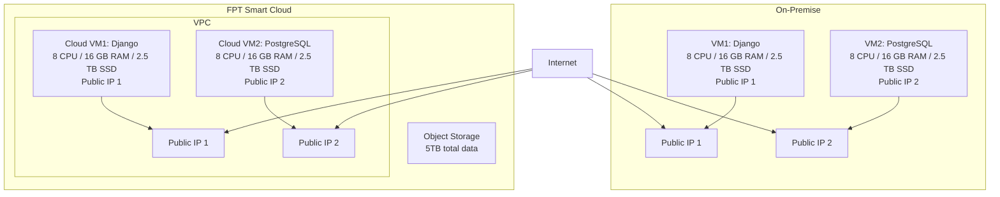

# Dự án di chuyển website lên FPT Smart Cloud

## Yêu cầu:
Khách hàng cần di chuyển hệ thống hiện tại từ hạ tầng on‑premise lên FPT Smart Cloud. Hệ thống bao gồm một website cá nhân sử dụng Python Django và một cơ sở dữ liệu PostgreSQL, đang được triển khai trên 2 máy chủ trong cùng 1 VPC. Việc chuyển đổi cần đảm bảo duy trì cấu hình tương đương với dung lượng lớn, có 2 IP công cộng. Backup dữ liệu không được đề cập, cũng như không yêu cầu monitoring và logging.

## Yêu cầu chi tiết từ khách hàng:
| Hạng mục                 | Thông tin yêu cầu                                                                   |
| ------------------------ | ----------------------------------------------------------------------------------- |
| **Hình thức triển khai** | Migration từ on‑premise lên FPT Smart Cloud                                         |
| **Thành phần hệ thống**  | Website cá nhân (Python Django) + Database (PostgreSQL) trên 2 máy chủ              |
| **Cấu hình VM yêu cầu**  | 16 CPU, 32 GB RAM, 5 TB SSD                                                         |
| **Mạng và truy cập**     | 2 public IP; không cần firewall                                                      |
| **Backup dữ liệu**       | **Không yêu cầu backup**                                                             |
| **Monitoring/Logging**   | **Không yêu cầu**                                                                    |
| **Dung lượng dữ liệu**   | Khoảng **5 TB** hiện tại (dùng để ước tính dung lượng lưu trữ)                    |

## Giải pháp đề xuất

## Phương án chuyển đổi

**Mô tả:**
| Bước                                 | Mô tả                                                                    |
| ------------------------------------ | ------------------------------------------------------------------------ |
| **1. Khảo sát & Phân tích hệ thống** | Đánh giá hệ thống hiện tại, tài nguyên VM, dữ liệu cần migrate           |
| **2. Chuẩn bị Hạ tầng Cloud**        | Tạo VM trên FPT Cloud với cấu hình tương đương, thiết lập mạng          |
| **3. Di chuyển Dữ liệu & Ứng dụng**  | Chuyển dữ liệu (SCP/Object Storage), cài đặt ứng dụng trên Cloud VM      |
| **4. Kiểm thử, Go-live**            | Kiểm tra toàn bộ hệ thống, chuyển DNS để điểm đến là hạ tầng Cloud       |

## Kế hoạch triển khai
| **STT** | **Tên Task**                     | **Mô tả**                                                                       | **PIC** | **Support** | **Duration (ngày)** | **Ghi chú**                           |
| ------- | -------------------------------- | ------------------------------------------------------------------------------- | ------- | ----------- | ------------------- | ------------------------------------- |
| 1       | Khảo sát hệ thống                | Thu thập thông tin về hệ thống hiện tại: cấu hình VM, dịch vụ, dữ liệu, network | KH      | FCI         | 2                   | Khách hàng cung cấp chi tiết hạ tầng  |
| 2       | Chuẩn bị Hạ tầng Cloud          | Tạo VM trên FPT Cloud với cấu hình tương đương, thiết lập mạng VPC, public IP | FCI     | KH          | 2                   | Truy cập SSH được chia sẻ cho KH test |
| 3       | Di chuyển Dữ liệu & Ứng dụng    | Chuyển dữ liệu từ on-premise lên Cloud VM (SCP/Object Storage), cài đặt ứng dụng trên Cloud VM | FCI | KH          | 3                   | Có thể tiến hành song song với task 4 |
| 4       | Kiểm thử, Go-live                | Kiểm tra toàn bộ hệ thống, chuyển DNS để điểm đến là hạ tầng Cloud            | FCI     | KH          | 1                   | Phải hoàn thành sau khi di chuyển dữ liệu |

## Tổng thời gian dự kiến
8 ngày (có thể giảm xuống ~5 ngày nếu thực hiện song song giữa các bước 3 và 4).

## Bảng giá dự kiến

| Tên sản phẩm             | Mô tả                                                   | Số lượng | Đơn vị tính | Ghi chú                                            | Đơn giá (VND) | Thành tiền (VND) |
| ------------------------ | ------------------------------------------------------- | -------- | ----------- | -------------------------------------------------- | ------------- | ---------------- |
| **vCPU**                 | Số nhân xử lý cho Cloud VM                              | 16       | vCPU        | Đáp ứng nhu cầu xử lý Django và PostgreSQL         | 150.000       | 2.400.000        |
| **RAM**                  | Bộ nhớ cho Cloud VM                                     | 32       | GB          | Đảm bảo hiệu năng xử lý web và truy vấn database   | 130.000       | 4.160.000        |
| **SSD**                  | Lưu trữ cục bộ cho Cloud VM                             | 5        | TB          | Lưu ứng dụng, hệ điều hành, PostgreSQL             | 3.000.000     | 15.000.000       |
| **Public IP tĩnh**       | Địa chỉ IP để truy cập VM từ Internet                   | 2        | IP          | Gán trực tiếp cho VM, phục vụ Web & SSH            | 15.000        | 30.000           |
| **Object Storage**       | Lưu trữ dữ liệu với dung lượng 5TB                      | 5        | TB          | Lưu dữ liệu của website, PostgreSQL                 | 2.500         | 12.500.000       |

## Tổng chi phí dự kiến / tháng (chưa gồm VAT):
**34.090.000 VND**

_Lưu ý:_
- Đơn giá ở đây là giá giả định, có thể thay đổi tùy theo chương trình khuyến mãi hoặc cam kết sử dụng.
- Một số dịch vụ như monitoring/logging có gói miễn phí, nhưng nên tư vấn khách hàng nâng cấp khi hệ thống mở rộng.