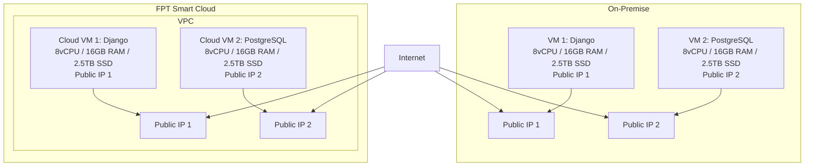

# Dự án di chuyển hạ tầng lên FPT Smart Cloud

## 1. Yêu cầu:
Khách hàng cần di chuyển hệ thống hiện tại từ hạ tầng on‑premise lên FPT Smart Cloud. Hệ thống bao gồm một website cá nhân dùng Python Django và một cơ sở dữ liệu PostgreSQL, đang chạy trên hai máy chủ trong cùng một VPC. Việc chuyển đổi cần đảm bảo duy trì cấu hình tương đương, có hai IP công cộng, và không yêu cầu firewall, monitoring, logging. Backup dữ liệu không được đề cập nhưng để đảm bảo an toàn, có thể xem xét hỗ trợ backup nếu có nhu cầu trong tương lai.

### Yêu cầu chi tiết từ khách hàng:
| Hạng mục                 | Thông tin yêu cầu                                                                   |
| ------------------------ | ----------------------------------------------------------------------------------- |
| **Hình thức triển khai** | Migration từ on‑premise lên FPT Smart Cloud                                         |
| **Thành phần hệ thống**  | Website (Python Django) + Database (PostgreSQL, chạy trên 2 máy chủ)               |
| **Cấu hình VM yêu cầu**  | 16 vCPU, 32 GB RAM, 5 TB SSD                                                        |
| **Mạng và truy cập**     | 2 public IP; không yêu cầu firewall                                                  |
| **Backup dữ liệu**       | **Không yêu cầu**                                                                   |
| **Monitoring/Logging**   | **Không yêu cầu**                                                                   |
| **Dung lượng dữ liệu**   | Khoảng **5 TB** hiện tại                                                            |

## 2. Giải pháp đề xuất

### Phương án chuyển đổi

**Mô tả:**
| Bước                               | Mô tả                                                                    |
| ---------------------------------- | ------------------------------------------------------------------------ |
| **1. Khảo sát & Phân tích hệ thống** | Đánh giá hệ thống hiện tại, tài nguyên VM, dữ liệu cần migrate           |
| **2. Chuẩn bị Hạ tầng Cloud**      | Tạo VM trên FPT Cloud với cấu hình tương đương, thiết lập mạng         |
| **3. Di chuyển Dữ liệu & Ứng dụng** | Backup + chuyển dữ liệu (SCP/Object Storage), cài app, khôi phục DB    |
| **4. Kiểm thử, Go-live**          | Kiểm tra toàn hệ thống, chuyển DNS, thiết lập giám sát nếu có nhu cầu   |

## 3. Kế hoạch triển khai
| **STT** | **Tên Task**                     | **Mô tả**                                                                       | **PIC** | **Support** | **Duration (ngày)** | **Ghi chú**                           |
| ------- | -------------------------------- | ------------------------------------------------------------------------------- | ------- | ----------- | ------------------- | ------------------------------------- |
| 1       | Khảo sát & phân tích hệ thống   | Đánh giá hệ thống hiện tại: cấu hình VM, dịch vụ, dữ liệu cần migrate          | KH      | FCI         | 2                   | Khách hàng cung cấp chi tiết hạ tầng  |
| 2       | Chuẩn bị hạ tầng Cloud          | Tạo VM trên FPT Cloud (16 vCPU, 32GB RAM, 5TB SSD), thiết lập mạng             | FCI     | KH          | 2                   | Truy cập SSH được chia sẻ cho KH test |
| 3       | Di chuyển dữ liệu & Ứng dụng    | Backup + chuyển dữ liệu bằng SCP/Object Storage, cài đặt ứng dụng, khôi phục DB | FCI     | KH          | 3                   | Bao gồm cả quá trình mất dữ liệu có thể xảy ra |
| 4       | Kiểm thử & Go-live               | Kiểm tra toàn bộ hệ thống, chuyển DNS sang địa chỉ mới, đảm bảo ứng dụng hoạt động | FCI     | KH          | 2                   | Nếu ứng dụng hoạt động bình thường sẽ Go-live ngay |

## Tổng thời gian dự kiến
**9 ngày** (có thể thực hiện song song các bước 2 và 3, rút ngắn tổng thời gian xuống còn khoảng 7 ngày). 

- Các bước 2 và 3 có thể được tối ưu thời gian thực hiện song song, điều này có thể giúp giảm tổng thời gian triển khai.

## 4. Bảng giá dự kiến
Dựa trên các yêu cầu và hạng mục dịch vụ mà khách hàng đã cung cấp, dưới đây là bảng giá dự kiến cho dịch vụ chuyển đổi lên FPT Cloud:

| Tên sản phẩm             | Mô tả                                                   | Số lượng | Đơn vị tính | Ghi chú                                            | Đơn giá (VND) | Thành tiền (VND) |
| ------------------------ | ------------------------------------------------------- | -------- | ----------- | -------------------------------------------------- | ------------- | ---------------- |
| **vCPU**                 | Số nhân xử lý cho Cloud VM                              | 16       | vCPU        | Đáp ứng nhu cầu xử lý Django và PostgreSQL         | 150.000       | 2.400.000        |
| **RAM**                  | Bộ nhớ cho Cloud VM                                     | 32       | GB          | Đảm bảo hiệu năng xử lý web và truy vấn database   | 130.000       | 4.160.000        |
| **SSD**                  | Lưu trữ cục bộ cho Cloud VM                             | 5        | TB          | Lưu ứng dụng, hệ điều hành, PostgreSQL             | 3.000.000     | 15.000.000       |
| **Public IP tĩnh**       | Địa chỉ IP để truy cập VM từ Internet                   | 2        | IP          | Gán trực tiếp cho VM, phục vụ Web & SSH            | 15.000        | 30.000           |

## Tổng chi phí dự kiến / tháng (chưa gồm VAT):
**21.590.000 VND**

Lưu ý:
- Đơn giá là giá tiêu chuẩn tham khảo, có thể thay đổi tùy theo chương trình khuyến mãi hoặc cam kết sử dụng.
- Chi phí này không bao gồm các dịch vụ như firewall, monitoring, logging theo yêu cầu của khách hàng.