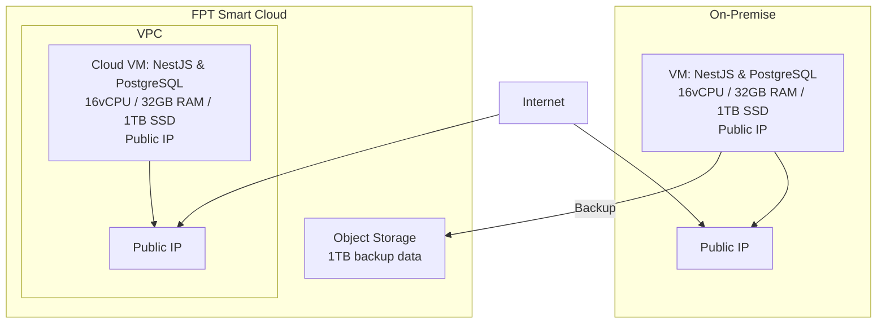
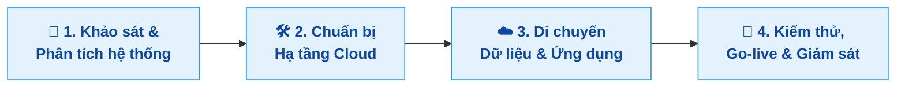

## Giải pháp đề xuất

## Phương án chuyển đổi

**Mô tả:**
| Bước                                 | Mô tả                                                                    |
| ------------------------------------ | ------------------------------------------------------------------------ |
| **1. Khảo sát & Phân tích hệ thống** | Đánh giá hệ thống hiện tại, tài nguyên VM, dữ liệu cần migrate           |
| **2. Chuẩn bị Hạ tầng Cloud**        | Tạo VM trên FPT Cloud với cấu hình tương đương, thiết lập mạng          |
| **3. Di chuyển Dữ liệu & Ứng dụng**  | Backup + chuyển dữ liệu (SCP/Object Storage), cài app, khôi phục DB      |
| **4. Kiểm thử, Go-live & Giám sát**  | Kiểm tra toàn hệ thống, chuyển DNS, thiết lập giám sát & backup định kỳ  |

## Danh sách sản phẩm sử dụng (BOM)

| Tên sản phẩm             | Mô tả                                                   | Số lượng | Đơn vị tính | Ghi chú                                            |
| ------------------------ | ------------------------------------------------------- | -------- | ----------- | -------------------------------------------------- |
| **vCPU**                 | Số nhân xử lý cho Cloud VM                              | 16       | vCPU        | Đáp ứng nhu cầu xử lý NestJS và PostgreSQL         |
| **RAM**                  | Bộ nhớ cho Cloud VM                                     | 32       | GB          | Đảm bảo hiệu năng xử lý web và truy vấn database   |
| **SSD**                  | Lưu trữ cục bộ cho Cloud VM                             | 1        | TB          | Lưu ứng dụng, hệ điều hành, PostgreSQL             |
| **Public IP tĩnh**       | Địa chỉ IP để truy cập VM từ Internet                   | 1        | IP          | Gán trực tiếp cho VM, phục vụ Web & SSH            |
| **Object Storage**       | Lưu trữ dữ liệu backup dung lượng 1TB                   | 1024     | GB          | Lưu dữ liệu lịch sử, backup định kỳ ngoài VM       |
| **Snapshot VM**          | Tự động sao lưu toàn bộ VM                              | 1        | bản         | Lên lịch backup định kỳ, phục hồi nhanh khi cần    |