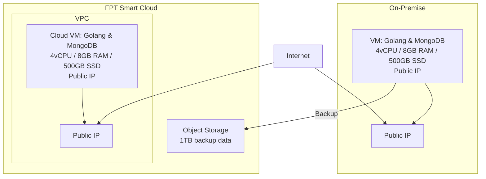
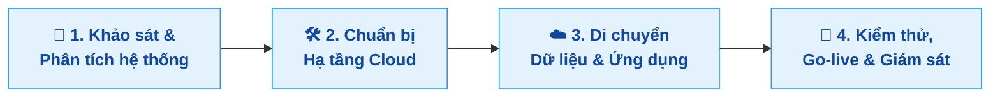

## Đề xuất giải pháp chuyển đổi hệ thống từ on-premise sang cloud:

## Phương án chuyển đổi

**Mô tả:**
| Bước                                 | Mô tả ngắn                                                               |
| ------------------------------------ | ------------------------------------------------------------------------ |
| **1. Khảo sát & Phân tích hệ thống** | Đánh giá hệ thống hiện tại, tài nguyên VM, dữ liệu cần migrate           |
| **2. Chuẩn bị Hạ tầng Cloud**        | Tạo VM trên FPT Cloud với cấu hình tương đương, thiết lập mạng, firewall  |
| **3. Di chuyển Dữ liệu & Ứng dụng**  | Backup + chuyển dữ liệu (SCP/Object Storage), cài app, khôi phục DB      |
| **4. Kiểm thử, Go-live & Giám sát**  | Kiểm tra toàn hệ thống, chuyển DNS, thiết lập giám sát & backup định kỳ  |